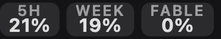
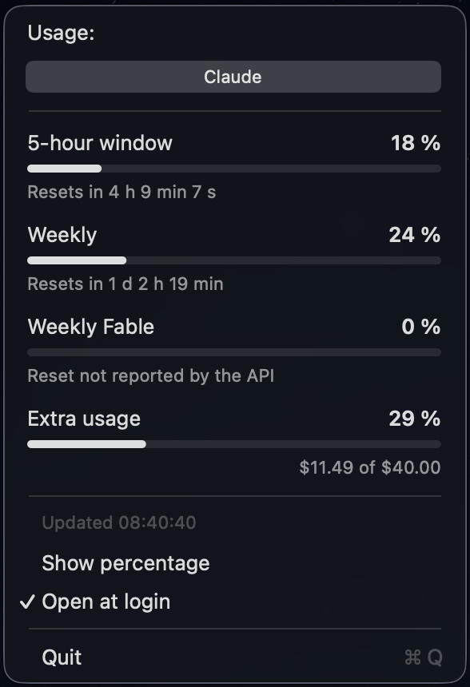

# AgentTray

[](https://github.com/lestex/agenttray/actions/workflows/build.yml)

A small macOS menu bar app that shows an agent's usage limits — each window with
a percentage, a bar, and a live countdown to its reset.

Claude is the provider it reads today: the 5-hour window, the weekly window and
the weekly top-model (Fable) window. Nothing outside `Usage.swift` knows that —
the menu bar, the menu and the cache all work from a generic `Snapshot` of
named windows, so a second agent means a second fetcher, not a second app.


Tick **Show percentage** in the menu to swap the gauges for labelled percentages:



Click it for the windows in full:



## Install

Grab the latest [release](https://github.com/lestex/agenttray/releases) — a
universal build for Apple Silicon and Intel — or build it yourself below.

Releases are ad-hoc signed rather than notarised, so macOS blocks the first
launch: right-click the app and choose **Open**, or
`xattr -d com.apple.quarantine /Applications/AgentTray.app`.

## Build and run

```sh
./build.sh          # produces build/AgentTray.app
open build/AgentTray.app
```

Requires the Xcode command line tools (`swiftc`) and macOS 14+. No Xcode
project, no packages.

`UNIVERSAL=1` builds both architectures, `AGENTTRAY_VERSION` sets the bundle
version — that is what the release workflow does on a `v*` tag.

To install it for real:

```sh
cp -R build/AgentTray.app /Applications/
```

Then tick **Open at login** in the menu.

## Using it

- **Click** the menu bar item — a menu listing every window, each with a bar
  and its reset countdown.
- The four gauges are the three windows plus extra-usage credits, filled bottom
  up. Hover the item for the numbers spelled
  out; tick **Show percentage** in the menu to keep them on screen.
- A fetch that fails replaces the gauges with an amber **!**, so stale numbers
  can never pass for current ones. The menu still lists the cached values with
  the reason alongside the timestamp.
- Refresh is entirely background: at launch, every 15 minutes, and on waking
  from sleep. Nothing you click triggers a fetch.

## Polling, caching and rate limits

The usage endpoint rate limits, and it answers a 429 with `retry-after: 0`,
which tells you nothing — so the app is deliberately unhurried:

- polls every 5 minutes; the countdowns tick locally between polls
- a 60-second freshness guard de-dupes triggers that coincide
- on a 429 it backs off 30 s, 60 s, 120 s … up to 10 minutes, and the backoff
  holds even for the manual refresh button
- the last successful snapshot is cached to
  `~/Library/Caches/com.lestex.agenttray/usage.json`, so a relaunch shows the
  previous numbers straight away and a failed refresh keeps them on screen with
  an amber warning next to the timestamp (hover it for the reason)

## Where the numbers come from

The app reads the Claude Code OAuth token from the Keychain (generic password
service `Claude Code-credentials`, with `~/.claude/.credentials.json` as a
fallback) and calls `GET https://api.anthropic.com/api/oauth/usage` — the same
endpoint `/usage` in Claude Code uses. Nothing is sent anywhere else, and the
token is only ever put in that request's `Authorization` header.

The first launch after each build shows a Keychain prompt, because the app is
ad-hoc signed and a rebuild changes its signature. Choose **Always Allow**.

If the token has expired, the menu says so; run `claude` once in a terminal
to refresh it and the app will pick up the new token on its next poll.

### Response shape

```sh
build/AgentTray.app/Contents/MacOS/AgentTray --dump
```

prints the raw payload. Windows are matched by key in `UsageAPI.known`
(`Sources/AgentTray/Usage.swift`):

| API key        | Shown as       | Menu bar |
| -------------- | -------------- | -------- |
| `five_hour`    | 5-hour window  | `5H`     |
| `seven_day`    | Weekly         | `WEEK`   |
| `nimbus_quill` | Weekly Fable   | `FABLE`  |

The weekly top-model window ships under a rotating codename (`nimbus_quill`
today, `seven_day_opus` on older accounts). Any *unrecognised* window that
reports a `utilization` still shows up in the menu with a humanised title —
so when the codename rotates again, add a row to that table to give it a proper
name and a menu bar pill. `extra_usage` credits get the footer line; `spend` is
ignored.

## Why a menu, not a panel

The dropdown is an `NSMenu` with custom views for the window rows. An earlier
version was a hand-built `NSPanel` — and reproducing menu chrome by hand (blur,
scrim, corner radius, shadow, text colours) never quite matched the system's,
however carefully the colours were measured. A menu simply is that chrome. The
panel version is kept in `attic/` for its layout, but is outside the build.

Its rows draw content on a transparent background and are deliberately neutral:
orange bars tinted the whole surface warm, which is what made the panel look
wrong next to a system menu even when its grey matched. Colour stays in the menu
bar, where you notice it without looking.

## The app icon

`Resources/AppIcon.icns` is generated from the same vector as the menu bar mark:

```sh
./tools/make-icon.sh
```

Only needed when the mark changes; `build.sh` copies the existing `.icns` into
the bundle.

## The mark

The robot head in `RobotMark.swift` is a vector path in a unit box, filled with
the even-odd rule so the eyes stay hollow — no image assets, crisp at any size.
It is drawn in `labelColor` so it flips with the menu bar between light and
dark; swap that for `Palette.claudeOrangeNS` in `StatusIcon.drawMark` if you
want it always orange.

## Layout

| File               | What it does                                        |
| ------------------ | --------------------------------------------------- |
| `Usage.swift`      | Keychain, API call, tolerant parsing, formatting     |
| `UsageModel.swift` | Observable state, polling, login item                |
| `AppDelegate.swift`| Status item, timers                                 |
| `StatusMenu.swift` | The dropdown menu                                   |
| `GaugeRowView.swift`| A window's row inside the menu                     |
| `StatusIcon.swift` | Draws the menu bar pill strip                        |
| `RobotMark.swift`  | The robot-head mark, as a vector path                |
| `Palette.swift`    | Colours and the utilisation thresholds               |
